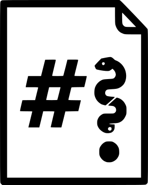

<div align="center">
  

  # blogcraft

  **A minimal, command-line static site generator written in Python.**

  Converts Markdown files into a static HTML website with built-in syntax highlighting, responsive styling, and RSS feed generation.

  [](https://www.python.org/)
</div>

## Installation

### Prerequisites

* Python 3.x
* pip

### Setup

1. Set up the environment:

    ```bash
    python3 -m venv .venv
    source .venv/bin/activate  # Windows: .venv\Scripts\activate
    pip install -r requirements.txt
    ```

### Compilation (Optional)

To build a standalone executable:

```bash
python make_exe.py
```

The binary is output to `dist/`.

## Usage

### Creating Content

Initialize a new article structure:

```bash
python blogcraft.py new my-post-slug
```

This creates a directory in `md/` with a template `article.md`. Edit the file to add your content. Frontmatter metadata (`title`, `date`) is required.

### Building the Site

Generate the static HTML files:

```bash
python blogcraft.py build
```

Output files are located in the `public/` directory.

If `rss` is enabled in your configuration, an RSS feed will be generated at `public/feed.xml`.

## Configuration

Configuration is managed via `config.json` in the project root.

**Example:**

```json
{
    "site_title": "Your blog title",
    "site_url": "http://localhost:8800",
    "site_subtitle": "Your blog subtitle",
    "rss": true,
    "md_dir": "md",
    "public_dir": "public",
    "post_filename": "post.md",
    "assets_dir": "files",
    "default_editor": "vim",
    "socials": {
        "Merazi": "https://merazi.github.io",
        "Google": "https://google.com"
    }
}

```

## ✍️ Creating and Managing Content

Content is organized into subdirectories within the configured md_dir (default: md/). Each subdirectory represents a single post.
Article Structure and Frontmatter

Every article file must start with a YAML-like frontmatter block enclosed by ---. This block is used to set the metadata for the post, including the display title and date.

Required Frontmatter Keys:

* title: The exact title used for the index page hyperlink and the browser tab title.
* date: The date of the post, displayed on the index page (format YYYY-MM-DD).

Example article.md:

```markdown
---
title: My First Article with Custom Title Casing
date: 2025-12-20
---

# Optional: Main On-Page Heading (This is still good for SEO)

This is the rest of the content for your article. Because the title is set in the frontmatter, you can control the text of the main heading independently, or omit it entirely if your Markdown already starts with a list or paragraph.

## Sub-heading
```

## 💻 Commands

| Command | Description | Example |
| :--- | :--- | :--- |
| `build` | Generates the static site from all Markdown content into the `public` directory. | `python blogcraft.py build` |
| `new <slug>`| Creates a new content directory and a template `article.md` file (including frontmatter). | `python blogcraft.py new project-launch` |
