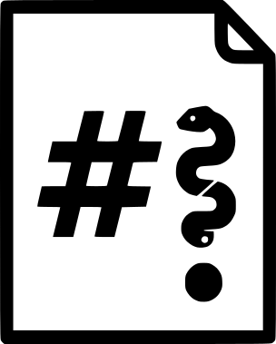

<div align="center">
  

  # blogcraft

  **A minimal, command-line static site generator written in Python.**

  Transform your Markdown files into a polished, responsive static website with built-in syntax highlighting and RSS support.

  [](https://www.python.org/downloads/)
  [](https://daringfireball.net/projects/markdown/)
  [](https://pygments.org/)
  [](https://www.python.org/)
</div>

---

## 🌟 Features

- **🚀 Instant Setup:** Interactive `init` command to get your blog running in seconds.
- **📝 Markdown Focused:** Write content in clean Markdown with YAML-like frontmatter.
- **⚡ Fast Generation:** High-performance static site generation.
- **🎨 Syntax Highlighting:** Beautiful code blocks powered by Pygments.
- **📱 Responsive Design:** Modern, mobile-friendly CSS included out of the box.
- **📡 RSS Feed:** Automatic generation of `feed.xml` for your readers.
- **👀 Live Preview:** Built-in dev server with `--watch` mode for real-time rebuilding.
- **🛠️ Standalone Binary:** Optional build process to create a single-file executable.

---

## 🚀 Quick Start

### 1. Prerequisites
* Python 3.8+
* pip

### 2. Setup Environment
```bash
python3 -m venv .venv
source .venv/bin/activate  # Linux/macOS
# .venv\Scripts\activate   # Windows
pip install -r requirements.txt
```

### 3. Initialize & Build
```bash
python blogcraft.py init     # Configure your site
python blogcraft.py build    # Generate HTML
python blogcraft.py serve    # Preview at http://localhost:8000
```

---

## 💻 Command Reference

| Command | Description |
| :--- | :--- |
| `init` | Starts an interactive setup to configure your blog metadata. |
| `new <slug>` | Scaffolds a new post directory and `article.md` template. |
| `build` | Compiles Markdown to HTML, generates index, RSS, and 404 pages. |
| `serve` | Starts a local server. Use `--watch` to rebuild on every save. |

---

## 📂 Project Structure

```text
.
├── blogcraft.py       # Main CLI entry point
├── controllers.py     # Logic for building and serving
├── models.py          # Data models for Config and Posts
├── views.py           # HTML templates and rendering
├── config.json        # Your blog's configuration
├── md/                # Source Markdown files (configurable)
│   └── hello-world/
│       ├── article.md
│       └── files/     # Post-specific assets
└── public/            # Generated static files (deploy this!)
```

---

## ⚙️ Configuration

Settings are managed in `config.json`. Most options can be configured during `init`.

```json
{
    "site_title": "My Blog",
    "site_url": "https://example.com",
    "site_subtitle": "Thoughts on code and life",
    "rss": true,
    "md_dir": "md",
    "public_dir": "public",
    "post_filename": "article.md",
    "assets_dir": "files",
    "default_editor": "vim",
    "socials": {
        "GitHub": "https://github.com/youruser",
        "Twitter": "https://twitter.com/youruser"
    }
}
```

---

## ✍️ Content Creation

### Frontmatter
Every article requires a metadata block at the top:

```markdown
---
title: My Awesome Post
date: 2026-05-01
---

# Your Content Starts Here
```

### Post Assets
Store images or files for a specific post in its `files/` (or configured `assets_dir`) subdirectory. Reference them in Markdown using relative paths: ``.

---

## 🛠️ Advanced: Standalone Binary

You can compile Blogcraft into a single binary for easier distribution using the provided `Makefile`:

```bash
make          # Builds binary in dist/
make install  # Installs to ~/.local/bin/
```

Note: You may need to install pyinstaller, either with pipx, your distro's package manager or by installing it with pip in the virtual environment.

---

## 🧪 Testing

To run the automated test suite:

```bash
export PYTHONPATH=$PYTHONPATH:.
python3 tests/test_blogcraft.py
```

---

## 🤝 Contributing

Contributions are welcome! Feel free to open issues or submit pull requests to improve Blogcraft.

---

## 📄 License

This project is licensed under the **GPLv3 License** - see the [LICENSE](LICENSE) file for details.

---

<div align="center">
  <sub>Built with ❤️ and 🐍 by Merazi.</sub>
</div>
